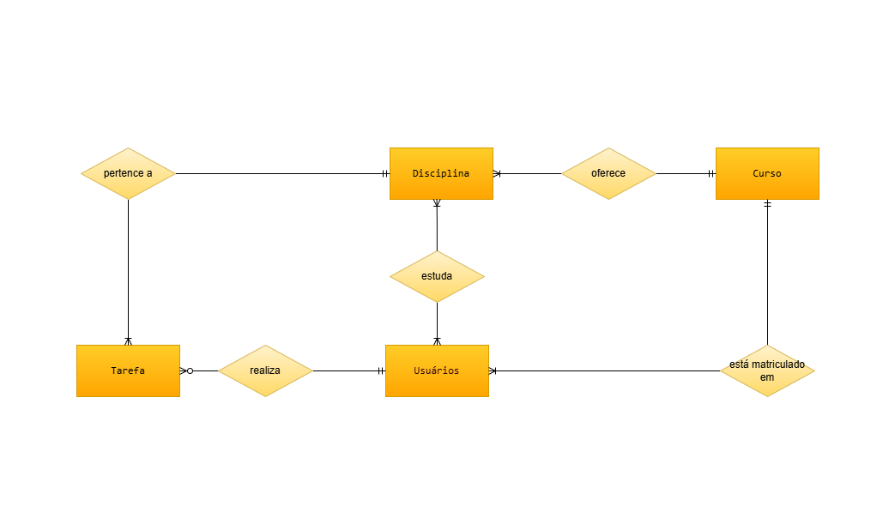

# Etapa 1 - Backend

## Descrição

Nesta primeira etapa do projeto, foi iniciado o desenvolvimento do backend utilizando **Spring Boot**. Foram criadas as entidades principais do sistema, bem como seus respectivos repositórios.

As entidades implementadas são:

- Usuário  
- Tarefa  
- Disciplina  
- Curso  

## Pré-requisitos

Para executar o projeto, é necessário ter instalado:

- Java 21 ou superior  
- MySQL instalado e em execução  
- Maven (ou utilizar o wrapper `./mvnw`)  

## Configuração do banco de dados

1. Crie um schema no MySQL com o nome:

```sql
CREATE DATABASE tarefasAlunos;
```

2. No arquivo `application.properties`, configure o nome de usuário e a senha do seu banco de dados:

```properties
spring.datasource.url=jdbc:mysql://localhost/tarefasAlunos?useTimezone=true&serverTimezone=UTC
spring.datasource.username=SEU_USUARIO
spring.datasource.password=SUA_SENHA

spring.jpa.hibernate.ddl-auto=update
spring.jpa.show-sql=true
```

## Como executar

Com o schema criado e as configurações ajustadas, execute o comando:

```bash
./mvnw spring-boot:run
```

Ou, caso utilize o Maven diretamente:

```bash
mvn spring-boot:run
```

---

# Etapa 2 - Modelagens

## Modelagem Conceitual



## Modelo Físico


## Diagrama de Classes UML


## Etapa 3 - Entrega do projeto final

Entrega da versão final do projeto com todas as funcionalidades implementadas. Foram realizados testes, revisões de código e ao longo da semana serão feitas correções de bugs e ajustes pontuais conforme identificados.

> Esta é apenas a estrutura inicial do projeto. Futuramente, serão adicionadas as camadas de controller e serviço, além das integrações com o frontend.
